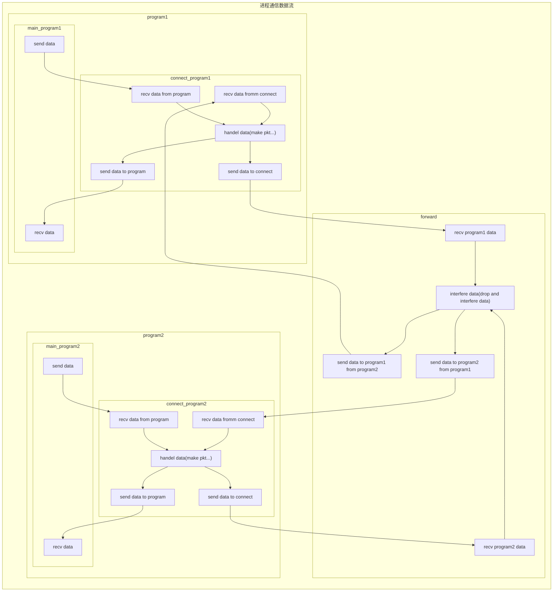

[TOC]
# 计算机网络：三种可靠的传输协议实现
## 1、代码结构
### 代码文件结构
1. 缓存工具文件：utils.h、utils.c&emsp;提供可靠的缓冲区读取、写入，以及缓冲区可读可写的信号传输
2. 协议工具文件：_rdt.h、_rdt.c&emsp;提供如打包pkt、校验码等函数、宏、结构体
3. 协议执行文件：rdt.h、rdt.c&emsp;&emsp;创建协议进程为处理原进程与目标进程协议交流
### 程序结构

graph LR
    subgraph 父子关系图
        main["main"]
        forward["forward"]
        client1["client1"]
        client1_protocol["client1_protocol"]
        client2["client2"]
        client2_protocol["client2_protocol"]

        main-->forward
        main-->client1
        main-->client2
        client1-->client1_protocol
        client2-->client2_protocol
    end

## 2、程序使用
1. 编译
进入对应协议文件夹
`make`
2. 执行
命令行文本回射
`./main`
传输文件
`./main < xxx > yyy`
3. 清理文件
`./make clean`

我的博客：https://blog.csdn.net/qq_33690566/article/details/105415681
